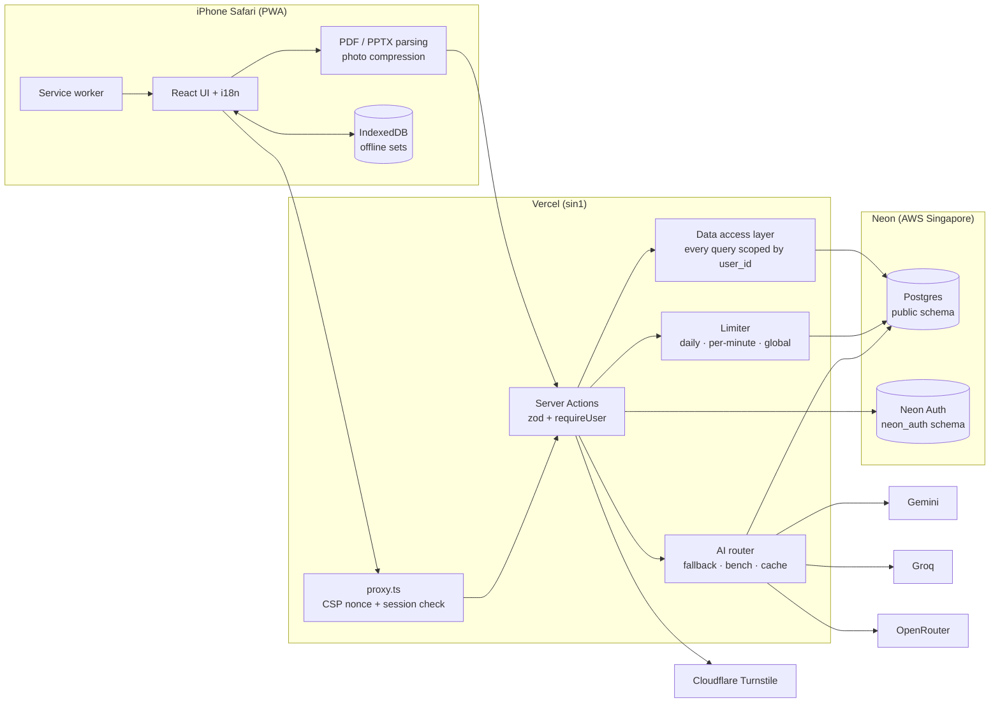

# Kodigo: AI Study Buddy

> *Ang kodigong pwedeng dalhin.*

Kodigo is a free, mobile-first study app for students reviewing for exams. Paste your notes, upload a PDF or PowerPoint, or snap photos of handwritten notes. Kodigo turns them into a summary and flashcards you can study with Flashcards and Learn mode. It works in **English and Tagalog** and installs on iPhone as a home-screen app.

## Features

**Phase 1 (done)**
- Sign up / log in with email + password, 6-digit email verification, password reset by code, Cloudflare Turnstile
- English ⇄ Tagalog UI, saved to your profile
- Create a set from pasted text, **PDF** (read in the browser), **PPTX** (slides + speaker notes, read in the browser), or **photos** (compressed in the browser, read once by a vision model, never stored)
- AI summary (markdown) + 10–60 flashcards, with an output-language override (Auto / English / Tagalog)
- Edit, add, delete and star cards
- **Flashcards**: tap to flip, swipe, shuffle, starred only
- **Learn**: multiple choice, true/false, identification and enumeration questions with explanations, lenient answer matching; missed cards come back until mastered
- Library with search, "due today" count and remaining AI allowance
- Read-aloud
- Dark mode
- AI router with automatic fallback across Gemini, Groq and OpenRouter, a result cache, and per-user + global limits
- Admin page: usage, model health, suspend and reset
- PWA: installable, offline page, recently opened sets study offline
- Delete my account, Privacy and Terms (EN/TL)

**Community**
- Share a set by link, or publish it publicly after automatic screening
- Copy a shared set into your own library
- Star ratings on shared sets
- Public profiles at `/u/handle`
- Follow other users, and a follow feed on Home
- Explore page to browse and search public sets
- Report a set, admin strikes and bans, Community Guidelines

**Coming next:** practice tests, spaced repetition (SM-2), AI tutor, explain/example buttons (Phase 2) · match game, streaks, Pomodoro, exam countdown (Phase 3) · Quizlet-style import, export (Phase 4).

## Stack

| Layer | Choice |
| --- | --- |
| Framework | Next.js 16 (App Router, TypeScript strict, `src/`) |
| Styling | Tailwind CSS 4 |
| Database | Neon Postgres (AWS Singapore) + Drizzle ORM (`neon-http` driver) |
| Auth | Neon Auth (managed Better Auth), email OTP verification |
| Bot protection | Cloudflare Turnstile + per-IP sign-up throttle |
| AI | Gemini, Groq, OpenRouter free tiers via the OpenAI-compatible API |
| Validation | zod on every input and every AI output |
| i18n | next-intl (`messages/en.json`, `messages/tl.json`) |
| Hosting | Vercel, functions in `sin1` (Singapore) |
| Tests | Vitest + PGlite (in-memory Postgres) |

## Architecture



**Security:**
- The browser never talks to the database. Server Actions get the user id from the session cookie only, and every query in `src/server/db/queries/*` filters by it. Tests in `tests/isolation.test.ts` prove user B can't read or change user A's data.
- AI and DB modules import `server-only`, and no secret uses `NEXT_PUBLIC_`.
- `npm run check:secrets` scans the client bundle for key patterns.

## Local setup

Requirements: Node 22.13+ (or 24), a Neon project with Auth enabled, and (optionally) Turnstile and AI keys.

```bash
git clone https://github.com/KlRAAA/Kodigo-AI-Study-Buddy.git
cd Kodigo-AI-Study-Buddy
npm install
cp .env.example .env.local   # then fill it in (see comments in the file)
npm run db:migrate            # creates the tables in your Neon database
npm run dev                   # http://localhost:3000
```

In the Neon console → **Auth**:
- Enable **Sign-up with Email** and **Verify at Sign-up** using **verification codes (OTP)**. Neon's shared email sender supports codes; links need your own SMTP.
- Add `http://localhost:3000` to the trusted domains.

Scripts:

| Command | What it does |
| --- | --- |
| `npm run dev` | Dev server |
| `npm run build` | Production build (also type-checks) |
| `npm run lint` | ESLint |
| `npm test` | Vitest (router, limiter, parsers, learn mode, answer matching, data isolation) |
| `npm run db:generate` | New migration from `src/server/db/schema.ts` |
| `npm run db:migrate` | Apply migrations |
| `npm run db:studio` | Browse the database |
| `npm run check:secrets` | Scan `.next/static` for leaked secrets (run after build) |

## Deployment (Vercel)

1. **Push to GitHub.** Push this repo to `github.com/KlRAAA/Kodigo-AI-Study-Buddy`.
2. **Import into Vercel.** Go to vercel.com → Add New → Project → import the repo. The framework is detected as Next.js. `vercel.json` already pins functions to **`sin1`** (Singapore, next to Neon); confirm under Settings → Functions → Region.
3. **Add every env var** (Settings → Environment Variables) from `.env.example`:
   - `DATABASE_URL`: Neon console → Connect → pooled connection string
   - `NEON_AUTH_BASE_URL`: Neon console → Auth → Configuration
   - `NEON_AUTH_COOKIE_SECRET`: run `openssl rand -base64 32`
   - `NEXT_PUBLIC_TURNSTILE_SITE_KEY`, `TURNSTILE_SECRET_KEY`: Cloudflare dashboard → Turnstile → your widget
   - `GEMINI_API_KEY`: Google AI Studio → Get API key
   - `GROQ_API_KEY`: console.groq.com → API Keys
   - `OPENROUTER_API_KEY`: openrouter.ai → Keys
   - `AI_TEXT_CHAIN`, `AI_VISION_CHAIN`, limits, `ADMIN_EMAILS`, and `NEXT_PUBLIC_APP_URL` (your Vercel URL)
   - `SAFE_BROWSING_API_KEY`: Google Cloud console → enable the Safe Browsing API → Credentials → API key restricted to that API
   - `DAILY_SHARES_PER_USER`, `DAILY_REPORTS_PER_USER`, `DAILY_FOLLOWS_PER_USER`, `DAILY_COPIES_PER_USER`: community limits (see [docs/limits.md](docs/limits.md))
4. **Allow your domain:**
   - Cloudflare Turnstile → your widget → **Hostnames**: add `your-app.vercel.app` (and any custom domain)
   - Neon console → Auth → **Trusted domains / redirect URLs**: add `https://your-app.vercel.app`
5. **Run migrations** against the production database (once, and after every schema change):
   ```bash
   DATABASE_URL="<production pooled url>" npm run db:migrate
   ```
   Then redeploy in Vercel so the new env vars take effect.

   **Upgrading an existing deployment** (one that runs the version before community sharing): migration `0002` drops the old `is_public` column that the previous version still reads, so apply the migrations in two steps:
   1. Apply `0001` only: in a local checkout, temporarily remove the `0002` and `0003` entries from `drizzle/meta/_journal.json` (don't commit this), then run `npm run db:migrate`.
   2. Deploy the new code.
   3. Restore the journal (`git checkout drizzle/meta/_journal.json`) and run `npm run db:migrate` again to apply `0002` and `0003`.
6. **Install on iPhone.** Open the site in **Safari** → tap **Share** → **Add to Home Screen** → **Add**. Kodigo now opens full screen like a native app.

## Changing AI models or limits

See [docs/limits.md](docs/limits.md).
